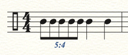

# NESTUP, the Nested Tuplet Generator

It's NESTUP! The domain specific language for describing and generating nested tuplets, just like you've always wanted.

## Getting set up

This library uses `yarn` as opposed to `npm`, so before you can do anything else you'll need `yarn` installed on your system. From there simply run

```sh
yarn install
```

to get the repo all set up.

## Generating rhythms

The NESTUP language is simple in that it ignores many of the conventions used to describe rhythmic subdivision and tuplets in "western" music notation. That is, NESTUP doesn't care if you are in compound or simple meter, or whether the tuplet is described in sixteenth notes or eighth notes. A musician writing in NESTUP simply describes the numbers of events (musical notes or rhythmic attacks) that should occur in a given period of time.



*Figure 1*

In the above figure, we see a measure of common time, where the first two beats of the measure contain 5 eighth notes in the space of 4 eighth notes, and the second half of the measure contains a quarter note on each beat.

There are actually a number of ways this rhythm could be rendered in NESTUP, depending on the user's preference. A simple way to write this rhythm could be:

```
{4
    (1, 2){5}
}
```
Another way to write it could be:

```
{2
    (1, 1){5}
    (2, 1){2}
}
```
How are these two examples equivalent? Well, let's look at how NESTUP works.

### How NESTUP Works

1. You specify a number of events using curly braces `{}`, so in our first example, we start by describing four beats with `{4}`.

2. To describe a further level of rhythmic subdivision, you use parentheses `()`, wherein you identify: 
- where, within the previously described events, this further level of rhythmic subdivision is to take place, and 
- the duration of the new rhythmic subdivision, described in terms of number of events in the preceding rhythmic level over which the new rhythmic subdivision should extend.

3. So in the initial example, `(1, 2)` describes that from the first event of the four events described by `{4}`, and lasting for the length of two of those events, there should be some number of events. How many events? The first example specifies `{5}`.

This gives us the rhythm from figure 1: 