# Nestup, the Nested Tuplet Generator [[]_[]]

It's Nestup! The domain specific language for describing and generating nested tuplets, just like you've always wanted. It also can divide anything that has dimension.

## Cheat Sheet

| Nestup_example_expression     | Description | Piano_roll |
| ----------- | ----------- | ----------- |
| `[4]`      | One event, 4 beats long | 
| `[[2] [2]]`   | Two events, each 2 beats long | 
| `[3 [2] [3]]` | Two events, squeezed into 3 beats. The first will have length `2/5` of 3 beats, and the second will have length `3/5` of 3 beats. | 
|`[[][]][2,3/7[][]]`|Four events, with the second two events scaled at a ratio of `3:7` to the first two. |
| `[4] {3}` | Three events, evenly spaced over 4 beats (aka a triplet over 4 beats) | 
| `[4] {3} [4] {5}` | A 3:4 triplet followed by a 5:4 quintuplet | 
| `[4] {3 (2) {3} }` | A triplet, where the second event has been itself subdivided into a triplet. A total of 5 note events | 
| `[4] {3 (2, 2) {5} }` | A triplet, where the second and third beat have been replaced with a quintuplet over that same time. A total of 6 events |  |
| `[4 [1] [1] {0} [1]]` | Three equally long notes in the space of 4 beats (aka a triplet), where the second note is a rest |  |
| `[4 [1] [1] _ [1] [1]]` | Four notes in the space of four beats, The second note is tied to the third. |  |
| `[4 {5 (2) [] _ (3) [] }]` | Five notes in the space of four beats, where the second note is tied to the third. |  |

## Getting set up

This library uses `yarn` as opposed to `npm`, so before you can do anything else you'll need `yarn` installed on your system. From there simply run

```sh
yarn install
```

to get the repo all set up.

## Why Nestup?

Most DAWs and other music software are designed to facilitate creating music with rhythmic subdivisions that divide in twos and into threes. However, there are many types of music in the world, such as the tabla rhythms from Indian classical music, rhythms by jazz musicians such as Tigran Hamasyan, drawing from Armenian folk traditions, or the nested tuplets common to "New Complexity" composers like Brian Ferneyhough, that do not divide solely into twos and threes. Most of these rhythms are rather difficult to program in any DAW.

In addition, DAWs that employ looping clips, for example Ableton Live or Logic Pro, facilitate the creation of clips that are defined by a number of 16th note subdivisions, making a loping clip of a "[fragmentary rhythm](https://www.instagram.com/p/CFxKMSMAS22/?utm_source=ig_web_copy_link)" very difficult to create.

Nestup is designed to be a simple solution for these and other rhythmic needs.

## Dividing Containers

In Nestup, we describe containers which are divided into parts. For the purposes of this documentation, where we are talking about music, those containers are generally periods of time, and those parts are generally experienced as events in time.

Music notation, and in particular "western" music notation, has its own conventions for describing the rhythmic subdivion of events in time.

The Nestup language is simple in that it ignores many of these conventions. That is, Nestup doesn't care if you are in compound or simple meter, or whether the tuplet is described in sixteenth notes or eighth notes. A musician writing in Nestup simply describes when events (such as musical notes or rhythmic attacks) occur in a given period of time.


*Figure 1*

In the above figure, we see a measure of common time, where the first two beats of the measure contain 5 eighth notes in the space of 4 eighth notes, and the second half of the measure contains a quarter note on each beat.

This could be rendered in multiple ways in Nestup, depending on the user's preference. One rendering of this rhythm could be:
```
[4
    []{5}
    []{2}
]
```
Another way to write it could be:

```
[4]{4
    (1, 2)[]{5}
}
```

Nestup doesn't have an explicit notion of beats or time signatures, it simply divides containers (of time) and generates events. So, Nestup could render this rhythm in at least these two ways. To understand what these examples are doing, let's look at how Nestup works.

## How Nestup Works

1. Here, we specify a **container** `[]`, with a **size** of 4, with `[4]`.

2. A container can contain child containers—in our first example, our container contains two containers, `[]` and `[]`, of equal size.

3. A container can be subvidided equally using the **subdivider** `{}`. In our first example, the first child container is subdivided into 5 subdivisions with `{5}`, and the second child is subdivided into 2 with `{2}`.

In our second example, we describe the rhythm a little differently.

1. We start, as in the first example, by specifying a container of size 4 with `[4]`.

2. This container is subdivided into 4 subdivisions with `{4}`.

3. A child container can be placed within those subdivisions, by specifying that container's **range:** where it should start, and how long it should continue. In the second example, the ranged container is placed on the first subdivision, stretched across two subdivisions, with `(1,2)[]`.

4. Finally, that ranged container is subdivided into 5 subdivisions with `{5}`.

Both of these examples gives us the rhythm from Figure 1: five evenly spaced events followed by two evenly spaced events that take up the same amount of time as the first five.


## The Simplest Nestup Expression

We can now take a step back and describe the Nestup language systematically, starting from its most simple expression.

### The Container

```
[]
```
The **container,** specified by the square brackets `[]`, defines a period of time, for example, a beat or a measure. If you are using Nestup to generate musical rhythms in a DAW like Ableton Live, the simple expression `[]` will generate one note spanning one beat in the DAW's global time signature. This is because every container has a **size**, which is by default 1. If you wanted your container to be 4 beats long, like a whole note in a 4/4 time signature, you would define the container size with `[4]`. *The container size can be any positive integer.*

Our `[4]` gives us a rhythm like:

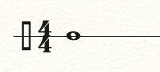 or, in the piano roll, 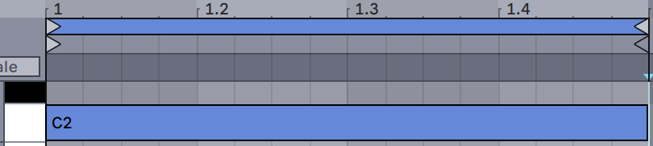 

#### Flexible Container
A container can be divided into child containers, for example, `[[2][2]]` will divide the container into two. Those child containers have a size of 2, and since the parent container has been given no explicit size, it is **flexible**, and inherits its size from the sum of its children's sizes—in this case, a size of 4. 

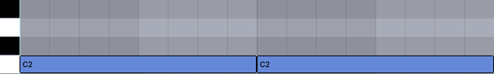 

To give another example, `[[3][2]]` will give us a container of size 5, for example, a five beat long rhythm, with a note spanning three beats and a note spanning two beats, like:

![[[3][2]] in piano roll](img/pno-roll-3.png "Figure 5") 

#### Fixed Container

What if you wanted to specify the size of the parent container to be 4, but keep the 3:2 porportion of the child containers? 

You can do this by specifying a size of the parent container, making it a **fixed container**, as with `[4[3][2]]`

![[4[3][2]] in piano roll](img/pno-roll-4.png "Figure 6") 

With a combination of fixed and flexible parent and child containers, we can generate a wide variety of rhythms.
```
[2[5][2]]
[[][2]]
[1[[][]][]]

[5[2[5][2]]
[[][2]]
[1[[][]][]]]
```
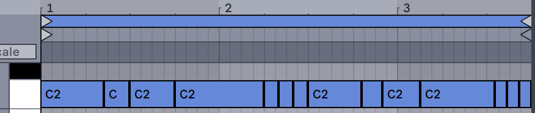 
or 
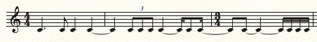 

#### Container Scale

You can also **scale** the size of a container by a ratio of two positive integers. It cannot be a decimal number. For example, `[2[][]][2, 3/5[][]]`, would generate a container of size two with two child containers, followed by a second container of size two with two child containers, this second one being 3/5 the size of the first.

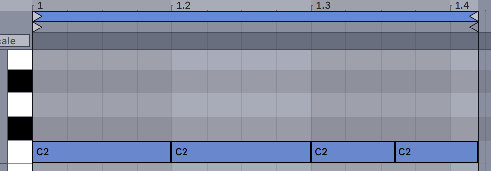 

In this way, Nestup facilitates the creation of looping clips with fragmentary meters in DAWs such as Ableton Live. Note that in the figure above, the end point of the loop is off of Ableton's "grid."

Note: if you wish to scale a container and want to maintain its flexible size, simply writing a comma `,` followed by the desired ratio will add a container scale while maintaining the container's flexibility. For example, `[,8/3[][]]`. 

This would be a container of size 2, because it is a parent container with children whose sizes sum to 2. That size is then multiplied by 8/3 to produce its final size.


### The Subdivider

A positive integer wrapped in curly braces `{}` evenly divides a container into that many subdivisions. For example, `[4]{3}` might be rendered in conventional western musical notation as:

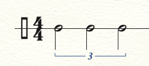

In the same way, `[4]{1}` gives us:


And `[4]{13}` gives us:

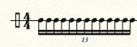

*Warning:* A container can only be subdivided with the subdivider if it has no child containers. For example, the expression `[[]]{3}` **is not valid.**

If you are subdividing a container of size 1 with no sibling containers, you can leave off the preceding `[]`. For example, `[]{5}` and `{5}` are equivalent. However, `{5}{5}` or `{5}[]{4}` **are not valid.**

#### Ranged Containers

Once you’ve subdivided a container, you can place more containers within those subdivisions. To place one of these ranged containers, you first specify a **range start** with `()`, followed by the container. For example, to place the container `[[2][1]]` on the first beat of a container subdivided into 3 parts, you would write `[]{3(1) [[2][1]] }`.
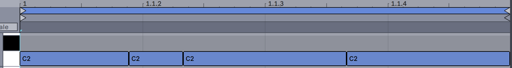

You can stretch that ranged container across multiple subdivisions by adding a **range length** to the range expression. For example, `[]{3 (1, 2) [[2][1]]}` would stretch the container across two subdivisions.
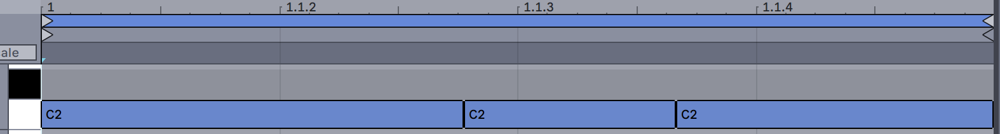

*Warning:* The size of the ranged container will always be determined by its range expression. For this reason, you can not give a ranged container a fixed size: `{3(1)[2]}` **is not valid**. Additionally, a ranged container cannot have siblings: `{3(1)[][]}` **is not valid**, though it can have children, as demonstrated in the examples above.

### Ties and Rests

Nestup has two additional features to help you generate rhythms: the ability to combine two adjascent containers, in a manner similar to a "tie" in western classical music notation, and the ability to insert silence over a container's duration, a "rest."

#### Ties

In Nestup, ties are written using the underscore `_` and connect sibling containers. When used, the subdivision before and after are combined. 

For example:
`[3]{5}_[]{3}` will give us:


#### Rests

In Nestup, rests are written using a subdivider with a value of 0, `{0}`.

For example,
```
[]
[] {0}
[3] {5
  (2) {0}
  (4, 2) {0}
}
```
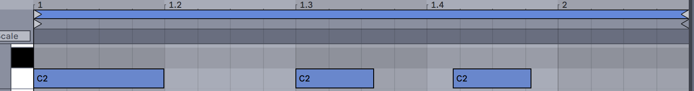

______
## Ableton-specific notes

If you are using the Nestup Max For Live device to parse your Nestup expressions, these notes are for you.

*Warning:* There is a known issue with Max For Live devices where if the device is not in focus (with the title bar of the device illuminated, for example), commands, such as ⌘+C or ⌘+V on Mac, will apply to the Live Session and not to the device, such as Nestup. You may be able to type into the Nestup code box, but this issue will persist. In addition, the character "0" will deactivate whichever device or track *is* in focus.

However, the solution is not to click on the title bar of the Nestup device, because in that case a typed "0" will turn off the Nestup device itself. Our recommendation is to click in the background of the Nestup patch (for example, near the words "Clip length") before typing in the code box. 
